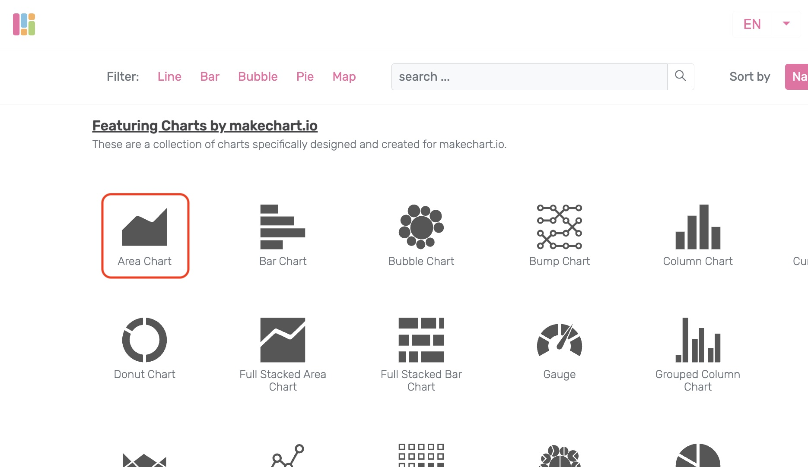
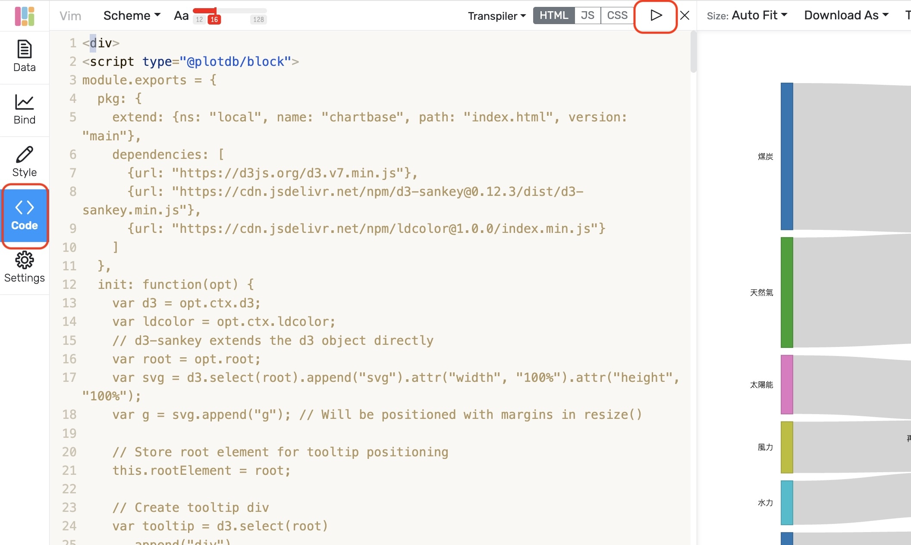
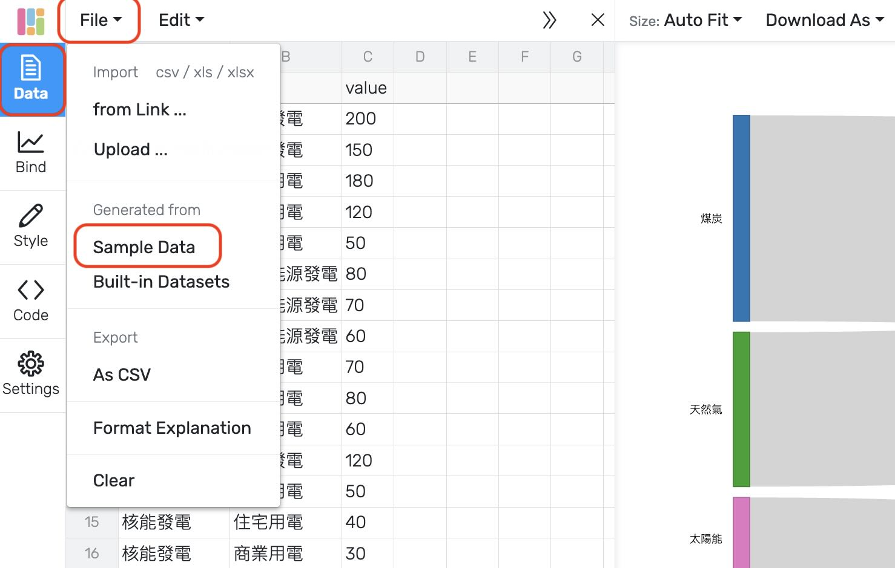

# prompt-sample

Here we provide a sample system prompt for generating makechart.io compatible chart block.

 - `prompt.md`: the complete prompt example. ( in Chinese )
 - `examples`: workable generated chart examples.

## usage

Use the provided `prompt.md` as your system prompt in any LLM code generator, and ask it to generate a chart. For example:

    Please generate a sankey chart in d3.js, with data on power generation and its corresponding types/sources as sample data as its sample data.

You can also use codes available under `examples` folder for a quick test.

Then, in [makechart.io](makechart.io), randomly pick a chart from its preset:

after entering the chart editor interface, clicking `Code`, pasting your code in the editor, and press the `play` button above:

If nothing shows up, go to `Data` tab, `File` dropdown menu and click `Sample Data`:

For any errors, check dev console and ask your LLM code generator to fix it. Iterate above until all errors are gone.

