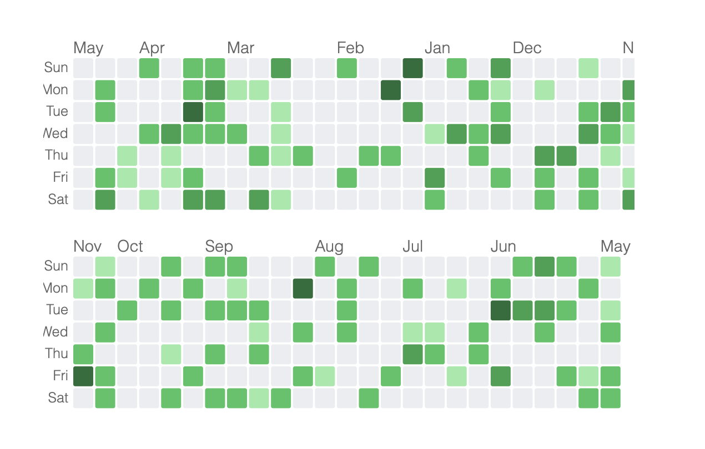
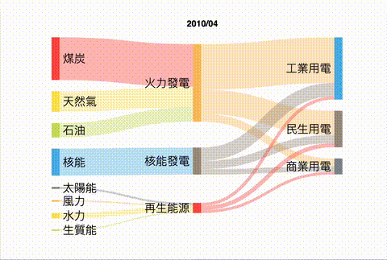
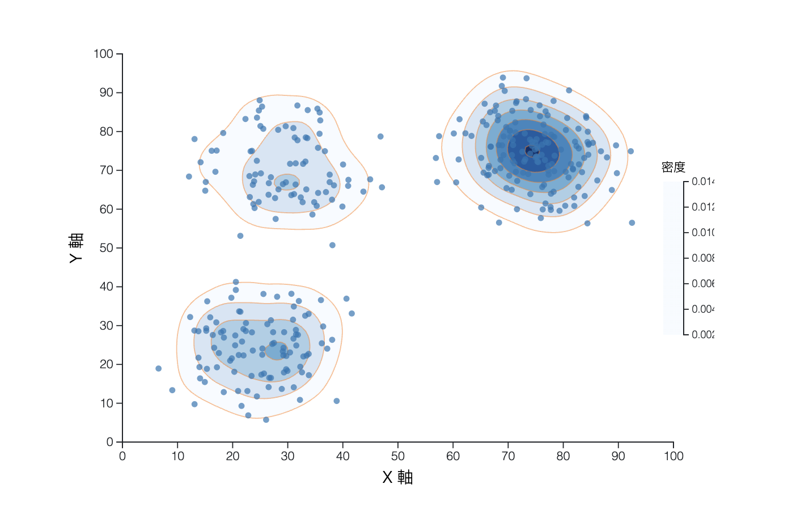
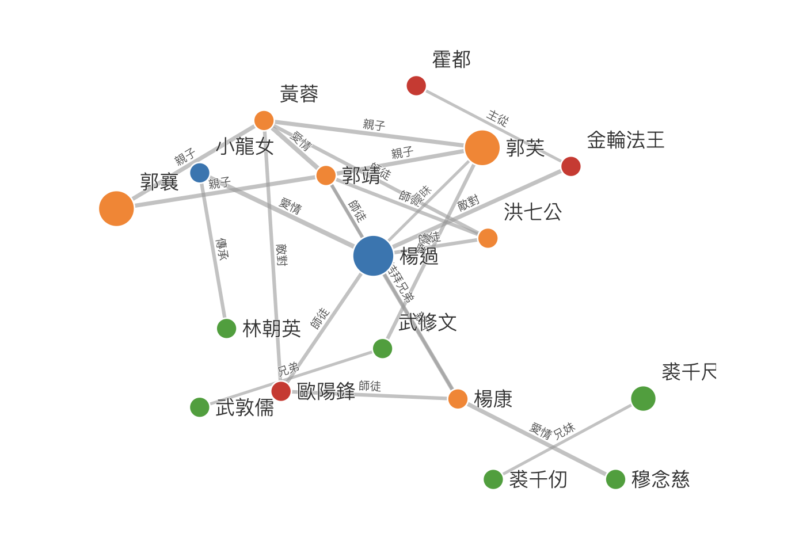
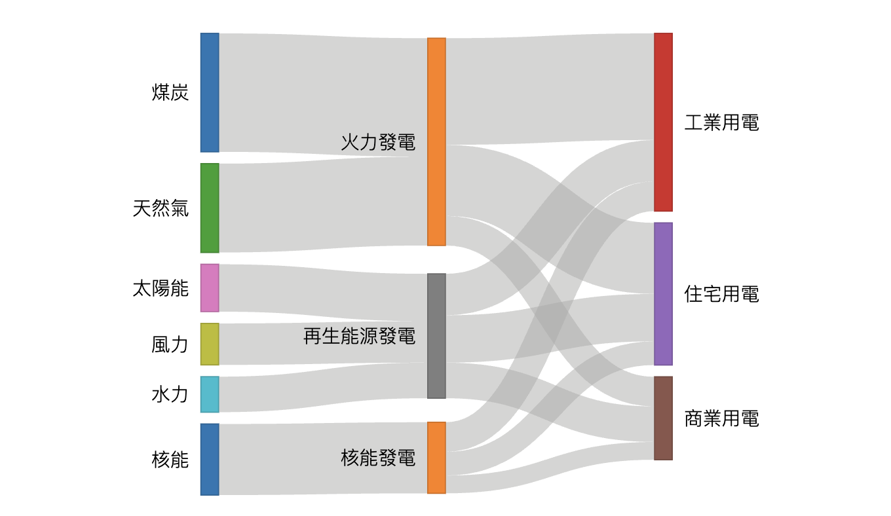

# Examples

This folder contains various chart code examples generated using prompt.md as the system prompt.

## [Calendar Heatmap](calendar-heatmap.html)

## [Racing Sankey](racing-sankey.html)

## [Contour Scatter Plot](contour-scatter-plot.html)

## [Relation Diagram](relation.html)

## [Sankey Chart](sankey.html)

